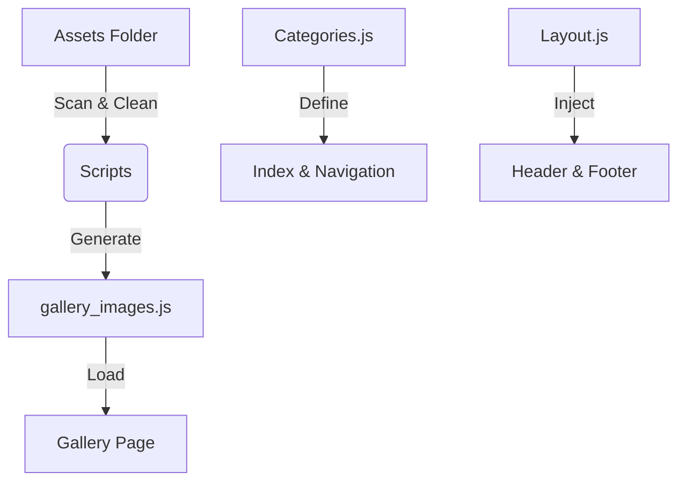

# 📸 Portfolio Maxime Colin


A high-performance static portfolio built for speed and simplicity.

---

## 🚀 Features

*   **⚡️ Static Power:** Fully static architecture. Zero backend. Deploys anywhere (`GitHub Pages`, `Netlify`, `S3`).
*   **🧩 Modular Design:** Header/Footer injected dynamically via **Alpine.js**. No copy-pasting HTML.
*   **📂 Centralized Data:**
    *   `categories.js` →  Gallery Content
    *   `gallery_images.js` → Auto-generated Manifest
    *   `awards.js` → Awards List
*   **🎨 Asset Workflow:** Automated scripts to **clean** filenames and **convert** to WebP.

---

## 🏗 Project Architecture



## 📂 Directory Structure

```plaintext
📦 mc-portfolio
 ┣ 📂 assets
 ┃ ┣ 📂 gallery      # Categories (e.g., /tabarnak/, /rer-nard/)
 ┃ ┗ 📂 awards       # Trophy images
 ┣ 📂 scripts
 ┃ ┣ 📜 clean-filenames.js          # 🧹 Removes accents, spaces, junk
 ┃ ┣ 📜 generate-gallery-manifest.js # ⚙️ Scans folder -> Updates JS
 ┣ 📂 src
 ┃ ┣ 📂 js
 ┃ ┃ ┣ 📜 categories.js       # 📚 The "Database"
 ┃ ┃ ┣ 📜 gallery_images.js   # 🖼 Generated File List
 ┃ ┃ ┗ 📜 layout.js           # 🧱 Shared Components
 ┃ ┗ 📜 input.css             # 🎨 Tailwind Source
 ┗ 📜 *.html                  # Static Pages
```

---

## 🛠 Development

### 1️⃣ Install
```bash
npm install
```

### 2️⃣ Watch Mode
```bash
npm run watch:css
```

### 3️⃣ Managing Photos 📸
Added new photos to `assets/gallery/`? Just Run:

```bash
# 🧹 Clean naming (No spaces, accents, copies)
node scripts/clean-filenames.js

# 🔄 Update the website manifest
node scripts/generate-gallery-manifest.js
```

---

## 🚀 Deployment

The project auto-deploys to **GitHub Pages** 🌐.

| Workflow | Trigger | Source |
| :--- | :--- | :--- |
| `.github/workflows/deploy.yml` | `git push origin main` | Root Directory (`.`) |

---

## ✍️ Credits

*   **Photography:** Maxime Colin
*   **Development:** Antigravity
